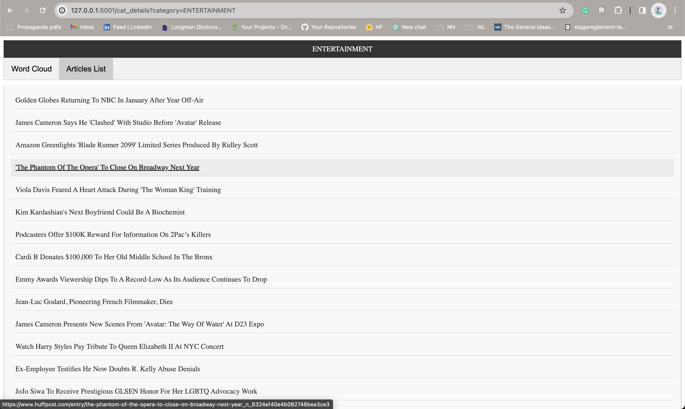

# HuffPost News Analysis Project

## Overview
This repository hosts a web application designed for comprehensive analysis of HuffPost news data. The core functionality includes reading news data from JSON files, creating TF-IDF matrices, extracting high-weighted terms, and clustering news articles using K-Means clustering—all implemented from scratch.

## Features
* TF-IDF Matrix Generation: Custom function to create TF-IDF matrices from HuffPost news data.
* News Clustering: Implements K-Means clustering from scratch to group similar news articles.
* Keyword Extraction: Extracts highest weighted terms per news category, cluster, and article.
* Keyword Cloud Visualization: Displays keyword clouds for each article, category, and cluster.
* Bubble Chart Visualization: Display bubble charts of news categories and clusters. 
* Interactive Web Application: A user-friendly web application with multiple tabs for easy navigation and analysis.

## Web Application Structure
The web application has three main tabs on the home page:

* News Articles:
   - Displays news headlines with details like link, date, authors, and a short description.
   - Clicking on a headline reveals more details.
   - Each news item is accompanied by a keyword cloud.

* Categories:
   - Shows a bubble chart of news categories.
   - Bubble size indicates the number of articles in each category.
   - Clicking on a bubble opens a page with all articles in that category and a keywords cloud of the category.

* Clusters:
   - Shows a bubble chart of news clusters.
   - Bubble size indicates the number of articles in each cluster.
   - Clicking on a bubble opens a page with all articles in that cluster and a keywords cloud of the cluster.

## Below are some screenshots of the web application: 
 
### Home page - News Articles tab (default tab)
 
 
### Home page - Article details
 

### Home page - Categories tab
 

### Home page - Clusters tab
 

### Category page - Articles tab
 

### Category page - Keywords tab

### Cluster page - Articles tab

### Cluster page - Keywords tab

